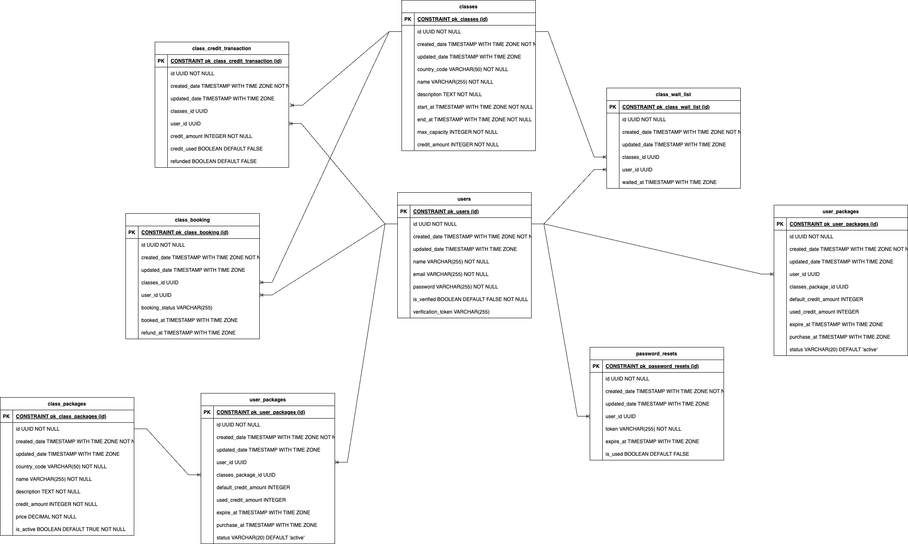

This project is a **Booking System** built using **Java**, **Spring Boot**, and **Maven**. It provides functionality for managing user accounts, purchasing class packages, booking classes, and performing check-ins. The system is designed with modularity in mind, separating core functionalities and user-specific modules.

## Features

- **User Management**:
   - Retrieve user profile information.
   - Change user passwords.

- **Package Management**:
   - Purchase class packages.
   - Retrieve purchased packages.

- **Booking Management**:
   - Retrieve user bookings.
   - Book classes.
   - Reuse bookings.
   - Wait list for classes.
   - Refund bookings from wait list users.
   - Perform check-ins for booked classes.

## Technologies Used

- **Java**: Programming language.
- **Spring Boot**: Framework for building the application.
- **Maven**: Dependency management and build tool.
- **JPA**: For database interaction.
- **SLF4J**: Logging framework.
- **PostgreSQL**: Database for storing user and booking information.
- **Quartz**: For scheduling tasks.
- **Flyway**: For database migrations.
- **Spring Security**: For securing the application and managing user authentication.
- **Swagger**: For API documentation and testing.
- **TestContainer**: For integration testing with a real database.

## Database Design

The database design for this project is illustrated below:



## Database Scripts

The project includes SQL script files for setting up the database initial data. These scripts are located in the `src/main/resources/data` directory.

### How to Run the Scripts

1. **Locate the Scripts**:
   - Data initialization script: `src/main/resources/db/dymmy_*.sql`
   

### Notes
- The `V1__init.sql` file contains the database structure (tables, relationships, etc.).
- The `dummy_*.sql` file contains initial data to populate the database.

## How to Run

1. **Clone the Repository**:
   ```bash
   git clone <repository-url>
   cd booking_system
   ```

2. **Build the Project (Need to run docker engine first)**:
   ```bash
   mvn clean install
   ```

3. **Run the Application**:
   ```bash
   mvn spring-boot:run
   ```

4. **Access the API Swagger**:
   The application will be available at `http://localhost:8080/swagger-ui/index.html#/`.

## Configuration

- **Database**: Configure the database connection in `application.yml` under `src/main/resources`.

## Testing

- Unit and integration tests can be added using JUnit.
- Run tests with:
  ```bash
  mvn test
  ```
